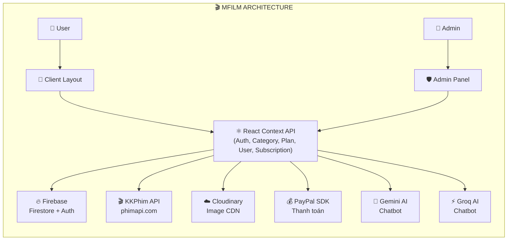

<div align="center">

# 🎬 MFILM — Xem Phim Online Chất Lượng Cao

<p><em>Nền tảng xem phim trực tuyến & quản trị nội dung phim toàn diện</em></p>

<a href="https://mfilm.online" target="_blank">
  
</a>
&nbsp;&nbsp;
<a href="https://github.com/NV-DuyManh/ManhFilm" target="_blank">
  
</a>

<br /><br />


<br />


<br />


</div>

---

<div align="center">

### 📋 Mục Lục

[`📖 Giới Thiệu`](#-giới-thiệu) · [`📸 Screenshots`](#-screenshots) · [`✨ Tính Năng`](#-tính-năng) · [`🛠️ Tech Stack`](#️-tech-stack) · [`📁 Kiến Trúc`](#-kiến-trúc-dự-án)

[`🚀 Cài Đặt`](#-cài-đặt--chạy) · [`🔐 Biến Môi Trường`](#-biến-môi-trường) · [`📜 Scripts`](#-scripts) · [`🌐 Deploy`](#-deploy) · [`👨‍💻 Tác Giả`](#-tác-giả)

</div>

---

## 📖 Giới Thiệu

**MFILM** là nền tảng xem phim trực tuyến được xây dựng bằng **React 19** & **Vite 8**, tích hợp dữ liệu phim từ **KKPhim API** (phimapi.com) kết hợp với **Firebase** làm backend. Hệ thống chia thành 2 phần chính:

| | Mô tả |
| :--- | :--- |
| 🍿 **Client** | Giao diện xem phim cho người dùng — trang chủ, chi tiết phim, trình phát video (ArtPlayer + HLS.js), tìm kiếm, bình luận, yêu thích, lịch sử xem, nâng cấp VIP, thuê phim, chatbot AI |
| 🛡️ **Admin** | Hệ thống quản trị — dashboard thống kê biểu đồ, quản lý phim/tập phim, metadata, entity (diễn viên/tác giả/nhân vật), cộng đồng (users/reviews/comments), gói VIP & thanh toán, Magic Import từ KKPhim |

> **Website:** [mfilm.online](https://mfilm.online) • Deploy trên **Vercel** • PWA Support

---

## 📸 Screenshots

### 🍿 Giao Diện Client (Người Dùng)

<details>
<summary><b>🏠 Trang Chủ — Banner & Hero</b></summary>
<br />
<div align="center">

</div>
</details>

<details>
<summary><b>🎞️ Trang Chủ — Phim Mới Cập Nhật</b></summary>
<br />
<div align="center">

</div>
</details>

<details>
<summary><b>🌏 Trang Chủ — Phim Theo Quốc Gia</b></summary>
<br />
<div align="center">

</div>
</details>

<details>
<summary><b>🏆 Trang Chủ — Top Phim </b></summary>
<br />
<div align="center">

</div>
</details>

<details>
<summary><b>🎬 Trang Chủ — Phim Chiếu Rạp</b></summary>
<br />
<div align="center">

</div>
</details>

<details>
<summary><b>📄 Trang Chủ — Bình luận</b></summary>
<br />
<div align="center">

</div>
</details>

<details>
<summary><b>🎌 Trang Chủ — Anime</b></summary>
<br />
<div align="center">

</div>
</details>

<details>
<summary><b>🎞️ Trang Chủ — Phim Hồng Kông</b></summary>
<br />
<div align="center">

</div>
</details>

<details>
<summary><b>📄 Chi Tiết Phim</b></summary>
<br />
<div align="center">


</div>
</details>

<details>
<summary><b>▶️ Trình Phát Phim (Video Player)</b></summary>
<br />
<div align="center">


</div>
</details>

<details>
<summary><b>🔍 Tìm Kiếm & Lọc Phim</b></summary>
<br />
<div align="center">

</div>
</details>

<details>
<summary><b>👤 Tài Khoản & Đăng Nhập</b></summary>
<br />
<div align="center">


</div>
</details>

<details>
<summary><b>💎 Nâng Cấp VIP & Thanh Toán</b></summary>
<br />
<div align="center">


</div>
</details>

<details>
<summary><b>🤖 Chatbot AI</b></summary>
<br />
<div align="center">

</div>
</details>

<details>
<summary><b>📱 Giao Diện Mobile (Responsive)</b></summary>
<br />
<div align="center">

</div>
</details>

---

### 🛡️ Giao Diện Admin (Quản Trị)

<details>
<summary><b>📊 Dashboard — Tổng Quan & Biểu Đồ</b></summary>
<br />
<div align="center">

</div>
</details>

<details>
<summary><b>📊 Dashboard — Top Phim & Top Thuê</b></summary>
<br />
<div align="center">

</div>
</details>

<details>
<summary><b>🎬 Quản Lý Phim</b></summary>
<br />
<div align="center">


</div>
</details>

<details>
<summary><b>📺 Quản Lý Tập Phim & Lịch Chiếu</b></summary>
<br />
<div align="center">


</div>
</details>

<details>
<summary><b>🏷️ Quản Lý Metadata (Thể Loại / Loại Phim / Chủ Đề)</b></summary>
<br />
<div align="center">


</div>
</details>

<details>
<summary><b>🎭 Quản Lý Entity (Diễn Viên / Tác Giả / Nhân Vật)</b></summary>
<br />
<div align="center">

</div>
</details>

<details>
<summary><b>👥 Quản Lý Cộng Đồng (Users / Reviews / Comments)</b></summary>
<br />
<div align="center">


</div>
</details>

<details>
<summary><b>💎 Quản Lý VIP (Plans / Features / Packages)</b></summary>
<br />
<div align="center">


</div>
</details>

<details>
<summary><b>💰 Quản Lý Thanh Toán (Thuê Phim / Subscriptions)</b></summary>
<br />
<div align="center">


</div>
</details>

<details>
<summary><b>⚡ Magic Import (Nhập Phim Từ KKPhim)</b></summary>
<br />
<div align="center">


</div>
</details>

---

## ✨ Tính Năng

### 🍿 Client — Trải Nghiệm Người Dùng

| Tính Năng | Mô Tả |
| :--- | :--- |
| 🏠 **Trang Chủ Đa Dạng** | Banner slider, phim mới, phim theo quốc gia (Nhật/Trung/Hàn/Việt), top phim, chiếu rạp, anime, Hồng Kông, phim sắp chiếu |
| ▶️ **Video Player Chuyên Nghiệp** | Tích hợp **ArtPlayer** + **HLS.js** — hỗ trợ Vietsub, Thuyết Minh, Lồng Tiếng, chuyển server, lưu tiến độ xem |
| 📄 **Chi Tiết Phim** | Thông tin đầy đủ (poster, banner, trailer, diễn viên, tác giả, nhân vật), danh sách tập, bình luận, đánh giá |
| 🔍 **Tìm Kiếm & Lọc** | Tìm theo tên, thể loại, quốc gia, phim lẻ/phim bộ |
| 💬 **Bình Luận & Đánh Giá** | Hệ thống comment real-time trên Firebase, rating phim |
| ❤️ **Yêu Thích & Danh Sách** | Lưu phim yêu thích, tạo danh sách phim cá nhân |
| 📜 **Lịch Sử Xem** | Tự động lưu & tiếp tục xem từ vị trí dừng (resume playback) |
| 💎 **Hệ Thống VIP** | Nhiều gói VIP với đặc quyền khác nhau, avatar frame, theme profile |
| 💰 **Thanh Toán** | Tích hợp **PayPal** — thuê phim lẻ hoặc đăng ký gói VIP |
| 🤖 **Chatbot AI** | Chatbot thông minh tích hợp **Google Gemini** & **Groq AI** — gợi ý phim, trả lời câu hỏi |
| 📅 **Lịch Chiếu** | Xem lịch chiếu phim theo ngày |
| 👤 **Tài Khoản** | Đăng nhập/đăng ký (Firebase Auth), quản lý profile, xem subscription, thông báo |
| 🔔 **Thông Báo** | Hệ thống notification cho người dùng |
| 📱 **PWA & Responsive** | Hỗ trợ Progressive Web App, responsive trên mọi thiết bị |
| ⚡ **Lazy Loading & SEO** | Code-splitting, lazy load sections, React Helmet cho SEO, auto retry chunk load |

### 🛡️ Admin — Hệ Thống Quản Trị

| Tính Năng | Mô Tả |
| :--- | :--- |
| 📊 **Dashboard Analytics** | 6 loại biểu đồ: Revenue, Plan Distribution, Demographic, Category, Rental Analysis, Top Films/Top Rents (Recharts) |
| 🎬 **Quản Lý Phim** | CRUD phim — tên, slug, poster, banner, năm, thời lượng, rating, giá thuê, trạng thái, quốc gia, thể loại |
| 📺 **Quản Lý Tập Phim** | Thêm/sửa/xóa episode, auto-sync tập mới từ KKPhim API |
| 📅 **Lịch Chiếu** | Quản lý showtime cho phim chiếu rạp |
| 🏷️ **Metadata** | Quản lý thể loại (Categories), loại phim (Category Types), chủ đề (Topics) |
| 🎭 **Entity** | Quản lý diễn viên (Actors), tác giả (Authors), nhân vật (Characters) |
| 👥 **Cộng Đồng** | Quản lý Users, Reviews, Comments |
| 💎 **VIP** | Quản lý Plans, Features, Packages |
| 💰 **Hóa Đơn** | Quản lý Rent Movies, Subscriptions |
| ⚡ **Magic Import** | Import phim hàng loạt từ KKPhim API — tự động parse dữ liệu, mapping thể loại, tạo episodes |
| ☁️ **Upload Ảnh** | Tích hợp **Cloudinary** — upload & optimize poster/banner |
| 🔍 **Search & Pagination** | Tìm kiếm, phân trang nâng cao trong admin |
| 🎄 **Seasonal Theme** | Hiệu ứng Noel trang trí admin panel |

---

## 🛠️ Tech Stack

| Lớp | Công Nghệ | Chi Tiết |
| :--- | :--- | :--- |
| **Frontend** | React 19, Vite 8 | SPA, Code-splitting, HMR, Lazy Loading |
| **Styling** | Tailwind CSS 4, MUI 7, SCSS | Utility-first CSS, Component library, Custom styles |
| **Animation** | Framer Motion 13 | Page transitions, micro-interactions |
| **Backend** | Firebase 12 | Firestore (NoSQL DB), Authentication, Real-time listeners |
| **Media** | Cloudinary, ArtPlayer, HLS.js, React Player | Image CDN, Video streaming, HLS protocol |
| **AI** | Google Gemini, Groq | Chatbot AI gợi ý phim |
| **Payment** | PayPal React SDK | Thanh toán VIP & thuê phim |
| **SEO** | React Helmet Async | Dynamic meta tags, Open Graph, Twitter Cards |
| **Routing** | React Router DOM 7 | Client-side routing, lazy routes |
| **State** | React Context API | Auth, Category, Plan, Subscription, User providers |
| **Charts** | Recharts 3 | Dashboard analytics & biểu đồ |
| **UI Kit** | React Icons, SweetAlert2, Swiper 12 | Icons, alerts, carousel sliders |
| **Data** | Axios, SheetJS (xlsx) | HTTP requests, Excel import/export |
| **Security** | Crypto-js | Mã hóa dữ liệu nhạy cảm |
| **Build** | Vite 8, ESLint 9 | Bundler, Linting |
| **Deploy** | Vercel | Hosting & CI/CD |
| **PWA** | vite-plugin-pwa | Progressive Web App support |

---

## 📁 Kiến Trúc Dự Án

```text
FILM_MANAGEMENT/
├── public/                        # Static assets
├── src/
│   ├── assets/                    # Images, logos, avatar frames
│   ├── components/
│   │   ├── admin/                 # Admin UI components
│   │   │   ├── HeaderAdmin        #   → Top bar admin
│   │   │   ├── MenuAdmin          #   → Sidebar menu
│   │   │   ├── PaginationAdmin    #   → Phân trang
│   │   │   ├── ModalChoose        #   → Modal chọn entity
│   │   │   ├── ModalDelete        #   → Modal xác nhận xóa
│   │   │   ├── DeleteBar          #   → Thanh xóa hàng loạt
│   │   │   └── search/            #   → Component tìm kiếm
│   │   ├── client/                # Client UI components
│   │   │   ├── header/            #   → Header & navigation
│   │   │   ├── footer/            #   → Footer
│   │   │   ├── chatBot/           #   → Chatbot AI (Gemini + Groq)
│   │   │   ├── menuAccount/       #   → Menu tài khoản
│   │   │   ├── loadingScreen/     #   → Loading animation
│   │   │   └── background/        #   → Background effects
│   │   └── common/                # Shared components
│   │       └── PageLoadingSpinner #   → Loading spinner
│   ├── config/
│   │   ├── firebaseConfig.js      # Firebase configuration
│   │   └── cloudinaryConfig.jsx   # Cloudinary configuration
│   ├── contexts/                  # React Context Providers
│   │   ├── AuthProvider           #   → Xác thực người dùng
│   │   ├── CategoryProvider       #   → Dữ liệu thể loại
│   │   ├── CategoryTypeProvider   #   → Loại phim
│   │   ├── PlanProvider           #   → Gói VIP
│   │   ├── SubscriptionProvider   #   → Đăng ký VIP
│   │   └── UserProvider           #   → Thông tin user
│   ├── hooks/
│   │   └── useCollections.js      # Custom hooks cho Firestore
│   ├── pages/
│   │   ├── admin/                 # ===== ADMIN PAGES =====
│   │   │   ├── dashBoard/         #   → Dashboard (6 charts + top films)
│   │   │   ├── movies/            #   → Quản lý phim, tập phim, lịch chiếu
│   │   │   ├── metaData/          #   → Thể loại, loại phim, chủ đề
│   │   │   ├── entity/            #   → Diễn viên, tác giả, nhân vật
│   │   │   ├── community/         #   → Users, reviews, comments
│   │   │   ├── vip/               #   → Plans, features, packages
│   │   │   ├── bills/             #   → Thuê phim, subscriptions
│   │   │   ├── magicImport/       #   → Import phim từ KKPhim
│   │   │   ├── homeAdmin/         #   → Layout admin
│   │   │   └── profile/           #   → Profile admin
│   │   └── client/                # ===== CLIENT PAGES =====
│   │       ├── home/              #   → Trang chủ (banner, sections)
│   │       ├── watch/             #   → Chi tiết phim & xem phim
│   │       ├── category/          #   → Phim theo thể loại
│   │       ├── country/           #   → Phim theo quốc gia
│   │       ├── singleMovies/      #   → Phim lẻ
│   │       ├── series/            #   → Phim bộ
│   │       ├── actors/            #   → Diễn viên
│   │       ├── topic/             #   → Chủ đề phim
│   │       ├── showtimes/         #   → Lịch chiếu
│   │       ├── pay/               #   → Thanh toán & VIP
│   │       ├── auth/              #   → Đăng nhập & đăng ký
│   │       └── account/           #   → Tài khoản cá nhân
│   ├── routers/
│   │   ├── AdminRouters.jsx       # Routes admin (20 routes)
│   │   └── ClientRouters.jsx      # Routes client (21 routes)
│   ├── services/
│   │   ├── firebaseService.js     # CRUD operations Firestore
│   │   ├── firebaseResponse.js    # Helper responses
│   │   ├── kkphimService.js       # KKPhim API integration
│   │   └── autoEpisodeSyncService.js  # Auto-sync episodes
│   └── utils/
│       ├── Constants.jsx          # App constants & configs
│       ├── appUtils.js            # Helper functions
│       ├── cloudinary.js          # Image optimization
│       ├── lazyRetry.js           # Lazy load with retry
│       └── watchHistory.js        # Lịch sử xem (localStorage)
├── .env                           # Environment variables
├── index.html                     # Entry HTML (SEO optimized)
├── vite.config.js                 # Vite configuration
├── vercel.json                    # Vercel deployment config
└── package.json                   # Dependencies & scripts
```

---

## 🚀 Cài Đặt & Chạy

### Yêu Cầu

- [Node.js](https://nodejs.org/) >= 18
- npm / yarn / pnpm
- Tài khoản [Firebase](https://firebase.google.com/) (Firestore + Auth)
- Tài khoản [Cloudinary](https://cloudinary.com/)
- (Tùy chọn) API Key [Google Gemini](https://ai.google.dev/) & [Groq](https://groq.com/) cho chatbot AI
- (Tùy chọn) Tài khoản [PayPal Developer](https://developer.paypal.com/) cho thanh toán

### Hướng Dẫn

**1. Clone repo**
```bash
git clone https://github.com/NV-DuyManh/ManhFilm.git
cd FILM_MANAGEMENT
```

**2. Cài dependencies**
```bash
npm install
```

**3. Cấu hình Firebase**

Mở `src/config/firebaseConfig.js` và cập nhật thông tin Firebase project:

```javascript
const firebaseConfig = {
    apiKey: "YOUR_API_KEY",
    authDomain: "YOUR_PROJECT.firebaseapp.com",
    projectId: "YOUR_PROJECT_ID",
    storageBucket: "YOUR_PROJECT.firebasestorage.app",
    messagingSenderId: "YOUR_SENDER_ID",
    appId: "YOUR_APP_ID",
    measurementId: "YOUR_MEASUREMENT_ID"
};
```

**4. Cấu hình Cloudinary**

Mở `src/config/cloudinaryConfig.jsx` và `src/utils/Constants.jsx` để cập nhật `cloud_name`, `upload_preset`, `apiKey`, `apiSecret`.

**5. Chạy development server**
```bash
npm run dev
```

**6. Mở trình duyệt**

Truy cập → `http://localhost:5173`

---

## 🔐 Biến Môi Trường

Tạo file `.env` tại thư mục gốc:

```env
# AI Chatbot (tùy chọn)
VITE_GEMINI_API_KEYS="your_gemini_api_key"
VITE_GROQ_API_KEYS="your_groq_api_key"
```

> **Lưu ý:** Cấu hình Firebase và Cloudinary nằm trong source code (`src/config/`). Đối với production, nên chuyển sang `.env`.

---

## 📜 Scripts

| Command | Mô Tả |
| :--- | :--- |
| `npm run dev` | Khởi chạy Vite dev server (HMR) |
| `npm run build` | Build production → thư mục `dist/` |
| `npm run preview` | Preview bản build production |
| `npm run lint` | Kiểm tra code với ESLint |

---

## 🌐 Deploy

Dự án đang được deploy trên **Vercel** tại [mfilm.online](https://mfilm.online).

File `vercel.json` đã cấu hình SPA rewrite:

```json
{
  "rewrites": [
    { "source": "/(.*)", "destination": "/index.html" }
  ]
}
```

---

## 🎯 Luồng Hoạt Động Chính



---

## 👨‍💻 Tác Giả

<div align="center">


<br />

### 👤 [Nguyễn Văn Duy Mạnh](https://github.com/NV-DuyManh)

<p align="center">
  <a href="https://github.com/NV-DuyManh" target="_blank">
    
  </a>
  &nbsp;&nbsp;
  <a href="https://mfilm.online" target="_blank">
    
  </a>
  &nbsp;&nbsp;
  <a href="https://github.com/NV-DuyManh/ManhFilm/stargazers" target="_blank">
    
  </a>
</p>

<p align="center">
  <sub>✨ <i>Cảm ơn bạn đã ghé thăm dự án <b>MFILM</b>. Hãy để lại 1 ⭐ star nếu bạn thấy hữu ích nhé!</i> ✨</sub>
</p>

<br />

<a href="#-mfilm--xem-phim-online-chất-lượng-cao">
  
</a>

<br /><br />

</div>
