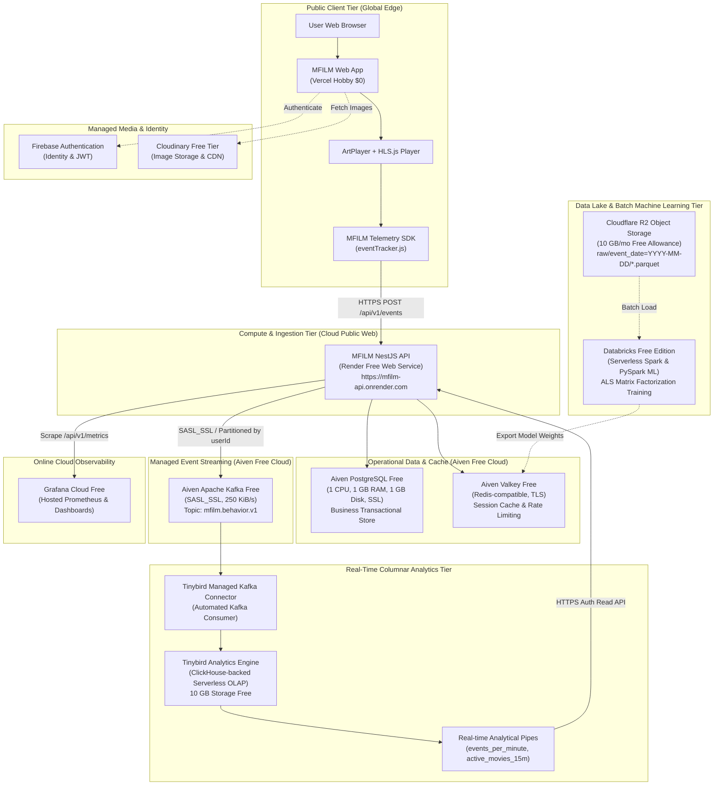
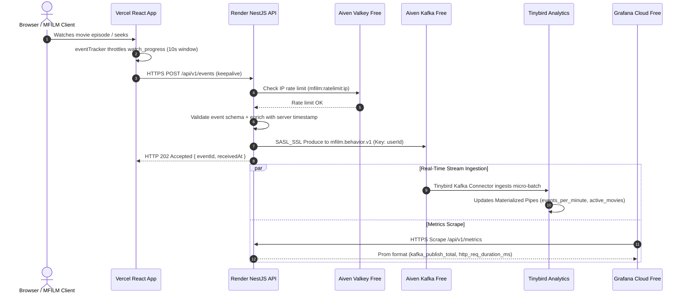

# MFILM Cloud-First Free-Only ($0) Architecture

## 1. Executive Summary

MFILM transitions from a local single-node development Docker setup to a **100% Online, Enterprise-Grade, Free-Only ($0 Mandatory Monthly Cost)** architecture.

### Architectural Tenets
1. **Zero Localhost Dependency**: The complete live demonstration operates over the public Internet.
2. **Strict $0 Budget**: Every chosen platform provides a verifiable, permanent free tier without requiring paid subscriptions.
3. **Real Managed Services**: No mocked message brokers or fake databases. Aiven Kafka, Aiven PostgreSQL, Aiven Valkey, Render, and Tinybird are genuine, cloud-hosted services.
4. **Resilient Dual-Path Analytics**:
   - **Online Real-Time Path**: `Browser -> Render NestJS -> Aiven Kafka -> Tinybird Managed Connector -> Real-time Analytics APIs`.
   - **Offline / Batch ML Path**: `Data Lake (Cloudflare R2 / Parquet Exports) -> Databricks Free Edition -> Collaborative Filtering & Model Training`.

---

## 2. High-Level Online Cloud Architecture Diagram

---

## 3. Component Responsibility & Mapping Matrix

| Layer | Service Provider | Plan / Tier | Cost | Primary Role |
| :--- | :--- | :--- | :---: | :--- |
| **Frontend** | Vercel | Hobby | **$0** | Hosts React 19 + Vite 8 SPA, PWA service workers, edge routing. |
| **Authentication** | Firebase Auth | Spark | **$0** | User signup, Google OAuth, session token issuance. |
| **Media Delivery** | Cloudinary | Free | **$0** | Image asset transformations, CDN delivery. |
| **Backend API** | Render | Free Web Service | **$0** | Ingests events, validates DTOs, publishes to Kafka, serves business APIs. |
| **Operational DB** | Aiven | Free PostgreSQL | **$0** | 29 relational tables, user profiles, subscriptions, movie catalog. |
| **Cache & State** | Aiven | Free Valkey | **$0** | Redis-compatible in-memory store for rate limiting, token blacklist, Tinybird cache. |
| **Event Broker** | Aiven | Free Apache Kafka| **$0** | Managed event streaming with SASL_SSL encryption and partition ordering. |
| **Real-Time OLAP** | Tinybird | Build (Free) | **$0** | Consumes directly from Aiven Kafka; serves sub-second trending and QoE queries. |
| **Data Lake** | Cloudflare | R2 Standard Free | **$0** | S3-compatible cold storage for partitioned event Parquet archives. |
| **Batch ML / Spark**| Databricks | Free Edition | **$0** | Offline model training (Collaborative Filtering ALS, Content feature engineering). |
| **Observability** | Grafana Cloud | Free Forever | **$0** | Telemetry dashboard, request rates, Kafka publishing error rates. |

---

## 4. End-to-End Online Data Flow

---

## 5. Network & Security Architecture

- **Zero Inbound Localhost**: All inter-service communications traverse public cloud networks using encrypted protocols:
  - HTTPS / TLS 1.3 for API endpoints.
  - PostgreSQL `sslmode=require` / `rejectUnauthorized=false` for Aiven managed databases.
  - `rediss://` (TLS) for Aiven Valkey.
  - `SASL_SSL` (SCRAM-SHA-256) over port 9092/9094 for Aiven Kafka.
- **CORS Restriction**: Render API enforces CORS whitelist strictly permitting the MFILM Vercel domain (`https://mfilm.online`, `https://*.vercel.app`) and local development origin (`http://localhost:5173`).
- **Quota Safeguard**: Valkey caches Tinybird query responses for 60 seconds, preventing redundant analytical calls and ensuring the frontend never exceeds the 1,000 requests/day free quota.
