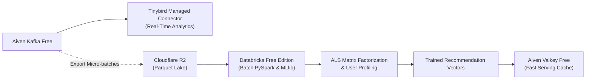

# Databricks Free Edition & PySpark ML Integration Analysis

## 1. Executive Summary

Databricks offers a no-cost **Free / Community Edition** designed for learning and single-node development. A critical objective of Phase 01.5 is evaluating whether Databricks Free can connect directly to Aiven Kafka over the public Internet.

---

## 2. Platform Constraints Evaluation

### A. Network Egress & Kafka Connectivity
- **Finding:** Databricks Free / Community clusters run inside a locked-down virtual network environment with **strict egress firewall rules**.
- Outbound TCP socket connections on non-standard ports (such as Aiven Kafka's TLS ports `9092` / `10000+`) are generally blocked or untrusted by Databricks Community egress controls.
- **Architectural Decision (Honest & Realistic):**
  - **Do NOT attempt to force direct Kafka Structured Streaming on Databricks Free.**
  - **Path A (Direct Kafka Streaming):** Marked as `BLOCKED BY FREE-TIER LIMITATION`.
  - **Path B (Batch & ML Processing):** Adopted as the primary cloud architecture for Databricks.

---

## 3. Recommended Architecture: Databricks as Cloud Batch & ML Layer

### 1. Real-Time Online Stream:
- Handled 100% by **Aiven Kafka -> Tinybird Managed Connector**.
- Delivers instant sub-second dashboard queries without dependency on Databricks uptime.

### 2. Databricks Batch ML Processing:
- Databricks notebooks read partitioned Parquet exports from Cloudflare R2 (or uploaded CSV/Parquet datasets).
- Executes offline **ALS (Alternating Least Squares)** matrix factorization model training (`data-platform/recommendations/collaborative.py`).
- Precomputes top-K recommendation lists and exports them into Aiven Valkey for low-latency serving.
