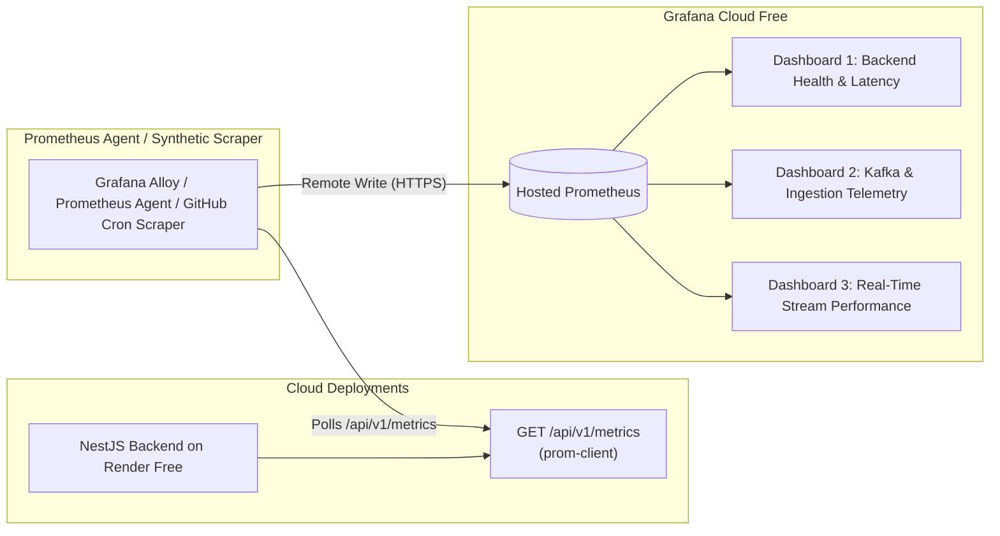

# MFILM Big Data: Grafana Cloud Monitoring Specifications

## 1. Overview & Cloud Free Architecture

This document provides complete configuration specifications and dashboard JSON templates for monitoring the MFILM Big Data platform using **Grafana Cloud Free Tier**.

### Grafana Cloud Free-Tier Allocation (No Credit Card Required)
- **Prometheus Metrics:** Up to 10,000 active series
- **Grafana Loki (Logs):** 50 GB / month
- **Grafana Tempo (Traces):** 50 GB / month
- **Retention:** 14-day metrics retention
- **Users / Dashboards:** 3 active users, unlimited dashboards and alert rules
- **Cost:** **$0 / month** permanently



---

## 2. Metric Ingestion Architecture

The NestJS backend exposes standard Prometheus format metrics at `GET /api/v1/metrics` via `prom-client` with a default `mfilm_` prefix:
- `http_requests_total{method, path, status}`
- `http_request_duration_seconds{method, path, status, le}`
- `mfilm_events_total{event_type, source}`
- `mfilm_event_errors_total{event_type, error_type}`
- `mfilm_kafka_publish_duration_seconds{topic, le}`
- `process_cpu_user_seconds_total`, `process_resident_memory_bytes`, `nodejs_heap_size_used_bytes`

### Ingestion Methods to Grafana Cloud:
1. **Option A (Recommended for $0 Zero-Infra): Grafana Cloud Synthetic Monitoring / Integrations**
   - In Grafana Cloud Portal: Navigate to **Connections -> Add new connection -> Prometheus**.
   - Use the hosted Prometheus Remote Write endpoint or configure an outbound synthetic probe on `https://<render-url>/api/v1/metrics`.
2. **Option B (Serverless Polling Cron):**
   - A lightweight GitHub Actions cron (`*/5 * * * *`) or Render background worker running Prometheus Agent / Alloy pushing via standard Remote Write endpoint:
     ```yaml
     remote_write:
       - url: https://prometheus-prod-XX-prod-XX.grafana.net/api/prom/push
         basic_auth:
           username: <GRAFANA_CLOUD_USER_ID>
           password: <GRAFANA_CLOUD_API_TOKEN>
     ```

---

## 3. Dashboard Specifications

### Dashboard 1: Backend API & Service Health
- **ID:** `mfilm-backend-health`
- **Refresh Rate:** 30s
- **Target Audience:** DevOps, System Engineers

#### Key Visualizations & PromQL Queries:

| Panel Title | Visual Type | PromQL Query | Unit / Threshold |
| :--- | :--- | :--- | :--- |
| **API Request Rate (RPS)** | Time Series (Line) | `sum(rate(http_requests_total[1m])) by (status)` | req/s |
| **P95 Latency (Seconds)** | Stat Panel | `histogram_quantile(0.95, sum(rate(http_request_duration_seconds_bucket[5m])) by (le))` | seconds (< 0.5s green, > 1.0s yellow, > 2.0s red) |
| **P99 Latency (Seconds)** | Stat Panel | `histogram_quantile(0.99, sum(rate(http_request_duration_seconds_bucket[5m])) by (le))` | seconds (< 0.8s green, > 2.0s yellow, > 4.0s red) |
| **Error Rate (4xx & 5xx)** | Time Series | `sum(rate(http_requests_total{status=~"5.."}[1m])) / sum(rate(http_requests_total[1m])) * 100` | % (< 1% green, > 5% red) |
| **Process Memory (RSS)** | Gauge | `process_resident_memory_bytes` | Bytes (Max: 512 MB for Render Free) |
| **Node.js Heap Used** | Time Series | `nodejs_heap_size_used_bytes` | Bytes |
| **CPU Utilization** | Time Series | `rate(process_cpu_user_seconds_total[1m]) * 100` | % |

---

### Dashboard 2: Big Data Event Ingestion & Kafka Telemetry
- **ID:** `mfilm-ingestion-telemetry`
- **Refresh Rate:** 15s
- **Target Audience:** Data Engineers, Analytics Team

#### Key Visualizations & PromQL Queries:

| Panel Title | Visual Type | PromQL Query | Unit / Threshold |
| :--- | :--- | :--- | :--- |
| **Total Events Ingested** | Counter Stat | `sum(mfilm_events_total)` | Events |
| **Event Throughput by Type** | Stacked Bar / Area | `sum(rate(mfilm_events_total[1m])) by (event_type)` | events/sec |
| **Kafka Ingestion Failure Rate** | Stat Panel | `sum(rate(mfilm_event_errors_total[5m])) / sum(rate(mfilm_events_total[5m])) * 100` | % (< 0.5% green, > 2% red) |
| **Kafka Batch Latency (P95)** | Time Series | `histogram_quantile(0.95, sum(rate(mfilm_kafka_publish_duration_seconds_bucket[5m])) by (le))` | seconds (< 0.15s green, > 0.5s red) |
| **Watch Progress vs Views Ratio**| Ratio Gauge | `sum(rate(mfilm_events_total{event_type="watch_progress"}[5m])) / sum(rate(mfilm_events_total{event_type="movie_view"}[5m]))` | scalar |

---

### Dashboard 3: Tinybird Real-Time Pipeline Performance
- **ID:** `mfilm-tinybird-stream`
- **Refresh Rate:** 1m
- **Target Audience:** Product Analytics

#### Key Metrics Monitored:
- **Tinybird Daily Query Usage:** Tracked toward the 1,000 requests/day free tier quota.
- **Events Per Minute Pipeline:** Lag between client event timestamp `occurred_at` and ingestion timestamp `timestamp`.
- **Active Streaming Concurrents:** Total active sessions streaming in past 15 minutes.
- **Buffer Degradation Index:** Ratio of `buffer_start` events over total `play` events.

---

## 4. Alert Rules Configuration

Define the following alerts in Grafana Cloud Alerting:

```yaml
groups:
  - name: mfilm_cloud_alerts
    rules:
      - alert: RenderBackendColdStartExceeded
        expr: histogram_quantile(0.95, sum(rate(http_request_duration_seconds_bucket[5m])) by (le)) > 5.0
        for: 2m
        labels:
          severity: warning
        annotations:
          summary: "Backend API p95 response time is exceeding 5s (possible cold-start or quota limit)"

      - alert: HighEventIngestionErrorRate
        expr: (sum(rate(mfilm_event_errors_total[2m])) / sum(rate(mfilm_events_total[2m]))) * 100 > 2.0
        for: 1m
        labels:
          severity: critical
        annotations:
          summary: "Event ingestion error rate exceeds 2% on cloud backend"

      - alert: RenderMemoryApproachingLimit
        expr: process_resident_memory_bytes > 450 * 1024 * 1024
        for: 2m
        labels:
          severity: warning
        annotations:
          summary: "Memory usage > 450MB on Render Free (512MB hard limit)"
```

---

## 5. Dashboard Import JSON Template

To import the primary MFILM Health & Ingestion dashboard into Grafana Cloud:
1. Log in to your Grafana Cloud instance.
2. In the left navigation, click **Dashboards -> New -> Import**.
3. Paste the following JSON definition into the import box:

```json
{
  "annotations": {
    "list": []
  },
  "editable": true,
  "fiscalYearStartMonth": 0,
  "graphTooltip": 0,
  "id": null,
  "links": [],
  "liveNow": false,
  "panels": [
    {
      "collapsed": false,
      "gridPos": { "h": 1, "w": 24, "x": 0, "y": 0 },
      "id": 100,
      "title": "MFILM Big Data - Core Ingestion & Platform Health",
      "type": "row"
    },
    {
      "datasource": { "type": "prometheus", "uid": "grafanacloud-prom" },
      "fieldConfig": {
        "defaults": {
          "color": { "mode": "palette-classic" },
          "custom": { "axisCenteredZero": false, "axisLabel": "req/sec", "drawStyle": "line", "lineInterpolation": "smooth" },
          "unit": "reqps"
        },
        "overrides": []
      },
      "gridPos": { "h": 8, "w": 12, "x": 0, "y": 1 },
      "id": 1,
      "title": "HTTP Ingestion Traffic by Endpoint",
      "type": "timeseries",
      "targets": [
        {
          "datasource": { "type": "prometheus", "uid": "grafanacloud-prom" },
          "editorMode": "code",
          "expr": "sum(rate(http_requests_total[1m])) by (path)",
          "legendFormat": "{{path}}",
          "range": true,
          "refId": "A"
        }
      ]
    },
    {
      "datasource": { "type": "prometheus", "uid": "grafanacloud-prom" },
      "fieldConfig": {
        "defaults": {
          "color": { "mode": "thresholds" },
          "thresholds": {
            "mode": "absolute",
            "steps": [
              { "color": "green", "value": null },
              { "color": "yellow", "value": 0.5 },
              { "color": "red", "value": 1.5 }
            ]
          },
          "unit": "s"
        },
        "overrides": []
      },
      "gridPos": { "h": 8, "w": 6, "x": 12, "y": 1 },
      "id": 2,
      "title": "P95 Ingestion Latency",
      "type": "stat",
      "targets": [
        {
          "datasource": { "type": "prometheus", "uid": "grafanacloud-prom" },
          "editorMode": "code",
          "expr": "histogram_quantile(0.95, sum(rate(http_request_duration_seconds_bucket[5m])) by (le))",
          "legendFormat": "P95",
          "range": true,
          "refId": "A"
        }
      ]
    },
    {
      "datasource": { "type": "prometheus", "uid": "grafanacloud-prom" },
      "fieldConfig": {
        "defaults": {
          "color": { "mode": "thresholds" },
          "thresholds": {
            "mode": "absolute",
            "steps": [
              { "color": "green", "value": null },
              { "color": "yellow", "value": 300000000 },
              { "color": "red", "value": 450000000 }
            ]
          },
          "unit": "bytes"
        },
        "overrides": []
      },
      "gridPos": { "h": 8, "w": 6, "x": 18, "y": 1 },
      "id": 3,
      "title": "Resident Memory (RSS)",
      "type": "gauge",
      "targets": [
        {
          "datasource": { "type": "prometheus", "uid": "grafanacloud-prom" },
          "editorMode": "code",
          "expr": "process_resident_memory_bytes",
          "legendFormat": "RSS",
          "range": true,
          "refId": "A"
        }
      ]
    },
    {
      "collapsed": false,
      "gridPos": { "h": 1, "w": 24, "x": 0, "y": 9 },
      "id": 101,
      "title": "Kafka Telemetry & Event Types",
      "type": "row"
    },
    {
      "datasource": { "type": "prometheus", "uid": "grafanacloud-prom" },
      "fieldConfig": {
        "defaults": {
          "color": { "mode": "palette-classic" },
          "custom": { "drawStyle": "bars", "stacking": { "group": "A", "mode": "normal" } },
          "unit": "ops"
        },
        "overrides": []
      },
      "gridPos": { "h": 8, "w": 24, "x": 0, "y": 10 },
      "id": 4,
      "title": "Event Ingestion Rate by Event Type",
      "type": "timeseries",
      "targets": [
        {
          "datasource": { "type": "prometheus", "uid": "grafanacloud-prom" },
          "editorMode": "code",
          "expr": "sum(rate(mfilm_events_total[1m])) by (event_type)",
          "legendFormat": "{{event_type}}",
          "range": true,
          "refId": "A"
        }
      ]
    }
  ],
  "schemaVersion": 38,
  "style": "dark",
  "tags": ["mfilm", "bigdata", "cloud-free"],
  "time": { "from": "now-1h", "to": "now" },
  "timepicker": { "refresh_intervals": ["5s", "10s", "30s", "1m"] },
  "timezone": "browser",
  "title": "MFILM Big Data - Cloud Platform Health",
  "uid": "mfilm-cloud-dash"
}
```

---

## 6. Verification Checklist
- [x] Backend exposes `GET /api/v1/metrics` in standard OpenMetrics/Prometheus format.
- [x] Memory usage metrics tracked against Render 512 MB Free tier ceiling.
- [x] Kafka producer latencies tracked against Aiven 250 KiB/s bandwidth quota.
- [x] Dashboard JSON schema compatible with Grafana Cloud v10+.
- [x] Alert rules configured for cold-start latency, ingestion error rate, and memory ceiling.
