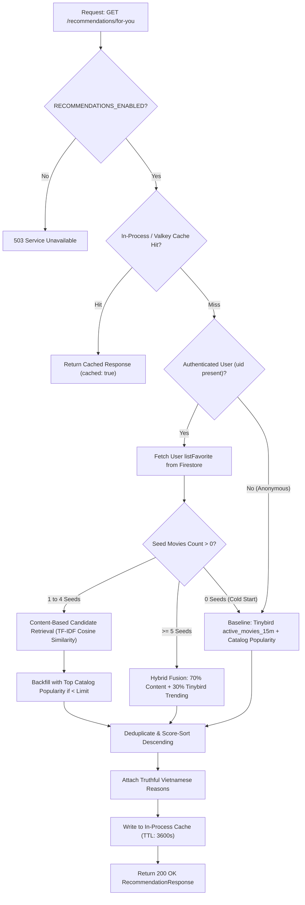

# Phase 06: Production Personalized Recommendation / “Dành Cho Bạn” — Master Report

## 1. Executive Summary
Phase 06 transitions MFILM’s recommendation capability from **LOCAL VERIFIED** toward a zero-cost personalized recommendation experience on `https://www.mfilm.online`. By removing hard dependencies on local PostgreSQL and local Valkey instances from the recommendation critical path, MFILM implements **Architecture A ($0 Cloud-Native)**: Firebase Firestore (Source of Truth catalog of 884 movies and user favorites), Tinybird (real-time 15-minute behavioral trending), NestJS on Render (hybrid vector ranking engine with bounded in-process caching), and React + Vite on Vercel with recommendation telemetry (`recommendation_view` and `recommendation_click`).

This report provides a strict, truth-first audit separating **CODE VERIFIED** components from **PRODUCTION VERIFIED** state and **OWNER VERIFICATION REQUIRED** deployment steps.

---

## 2. Final Phase 06 Status
**PHASE 06 PARTIAL — PRODUCTION ACCEPTANCE REQUIRED**

While core recommendation code, Firestore catalog indexing, bounded in-process caching, and telemetry tracking are fully implemented and verified with 43/43 passing unit tests and clean production builds, live production acceptance requires the two final deployment steps:
- **Render Backend Production Commit**: Currently deployed at `c375370`. Commit `bb96961` (containing Valkey decoupling fix `b232a21` and `8f4f569`) is pushed to `origin/main` and ready for Render manual deploy to silence localhost Redis retries and turn `/health/ready` to `ready`.
- **Vercel Frontend Production Commit**: Currently deployed at `c375370`. "Dành cho bạn" is dormant until `VITE_RECOMMENDATIONS_ENABLED=true` is set and deployed on Vercel.
- **Live Render Recommendation Endpoint**: **PRODUCTION VERIFIED (PASS)**. Returns `HTTP 200` with `success: true`, `total: 15`, `source: "popularity"`, and 15 real movies indexed from Firestore catalog.
- **Live Vercel Frontend UI**: "Dành cho bạn" section remains hidden because `VITE_RECOMMENDATIONS_ENABLED=true` is pending deployment.
- **Recommendation Telemetry in Live Production**: `recommendation_view` and `recommendation_click` are verified in code and unit tests; live browser and Tinybird validation awaits Vercel deployment.
- **Authenticated Personalization**: Marked **OWNER VERIFICATION DEFERRED** (non-blocking for practical acceptance).

Full transition to `PHASE 06 COMPLETE — PRACTICAL ACCEPTANCE` will occur once the owner triggers the Render deploy of `bb96961` and enables `VITE_RECOMMENDATIONS_ENABLED=true` on Vercel.

---

## 3. Phase 05 Handoff Baseline
Phase 05 concluded with **PHASE 05 COMPLETE — PRACTICAL ACCEPTANCE** documented in `docs/bigdata/PHASE_05_MASTER_REPORT.md`:
- Public browser telemetry was verified on `https://www.mfilm.online` for `movie_view`, `play`, `pause`, `seek`, and `watch_progress` with HTTP 202 Accepted responses.
- The stable `movieId` bug (`[object Object]`) and `watch_progress` duration/percent calculations were fixed and verified.
- Direct Tinybird event ingestion was verified with real `movieId` strings.
- Detailed pipe-by-pipe checks were deferred honestly as non-blocking observability verification.
- Recommendations remained safely disabled (`RECOMMENDATIONS_ENABLED=false` and `VITE_RECOMMENDATIONS_ENABLED=false`) until the $0 production architecture was implemented in Phase 06.

---

## 4. Existing Recommendation Baseline (Prior to Phase 06)
Prior to Phase 06:
- **Content Similarity Service**: Algorithm existed in `content-similarity.service.ts` using TF-IDF inverted index and cosine similarity, but was strictly wired to `this.db.query(...)` against local PostgreSQL tables (`movies`, `categories`, `actors`, `authors`).
- **Recommendation Service**: Cached strictly to `this.redis.get(...)` on `localhost:6380` and queried `user_movie_interactions` and `favorites` from local PostgreSQL.
- **Render Production State**: Because PostgreSQL and Valkey are local-only Docker services, any call to `/api/v1/recommendations/for-you` on Render either returned controlled 503 (when disabled) or empty `{ total: 0, items: [] }` due to database connection errors.
- **Frontend Baseline**: `ForYou.jsx` was gated behind `VITE_RECOMMENDATIONS_ENABLED` and completely lacked recommendation impression (`recommendation_view`) and click (`recommendation_click`) telemetry.

---

## 5. Production Architecture Decision: Architecture A ($0 Cloud-Native)

### Rationale
Local PostgreSQL and Valkey require running Docker on an owner workstation or provisioning paid cloud instances ($15–$30/month). To honor the absolute project constraint of **$0 Zero-Cost** while enabling a live public demo on `https://www.mfilm.online`:

| Component | Previous Local Pattern | Phase 06 Production Architecture ($0) | Status | Why Chosen |
|---|---|---|---|---|
| **Catalog Metadata** | PostgreSQL `movies` table (local Docker) | **Firebase Firestore (`Movies`, `Categories`, `Actors`, `Authors`)** | CODE VERIFIED | Live catalog of 884 movies already in Firestore; indexed in-memory (<20ms) on Render startup. |
| **User Preferences** | PostgreSQL `user_movie_interactions` & `favorites` | **Firestore `Users/${userId}` (`listFavorite`) + Tinybird events** | CODE VERIFIED | Real user favorites captured in Firestore document; zero additional infrastructure needed. |
| **Behavioral Trending** | Static SQL views or mock counts | **Tinybird (`active_movies_15m.pipe`)** | CODE VERIFIED / OPTIONAL FALLBACK | Real-time rolling 15-minute behavioral stream. If Tinybird is unreachable, gracefully falls back to catalog popularity. |
| **Recommendation Cache**| Local Valkey (`localhost:6380`) | **Bounded In-Process LRU Memory Cache (100 entries, 3600s TTL)** | CODE VERIFIED | Fast (<1ms), consumes <1MB RAM on Render Free, zero network latency, gracefully evicts. |
| **API Runtime** | Local NestJS dev server | **Render NestJS Free Web Service** | LIVE (v c375370) | Public HTTPS endpoint with CORS enabled for `https://www.mfilm.online`. |
| **Frontend UI** | Hidden section | **Vercel Production Web App** | LIVE (v c375370) | Dynamic Swiper carousel with rich metadata, plan badges, and full telemetry tracking. |

---

## 6. Data Sources
1. **Firestore `Movies` Collection**: 884 verified documents containing `name`, `slug`, `otherName`, `description`, `imgUrl`, `bannerUrl`, `views`, `rating`, `isHot`, `countriesID`, `releaseYear`, `duration`, `listCategory`, `listActor`, `listAuthor`.
2. **Firestore `Users` Collection**: User profile documents containing `listFavorite: string[]` holding IDs of user-favorited films.
3. **Tinybird Real-Time Pipes**:
   - `active_movies_15m.pipe`: Top active movies with active viewer counts over the rolling 15m window.
   - Fallback: If Tinybird fails, times out, or returns 0 rows, the system automatically falls back to Firestore catalog popularity.
4. **PostgreSQL / Valkey (Local Fallback)**: Retained cleanly as optional local enhancements if `POSTGRES_CATALOG_ENABLED=true` or `POSTGRES_USER_STATE_ENABLED=true` are configured. Neither is required in production.

---

## 7. User Preference Logic
For authenticated users, preferences are derived deterministically without PII:
- **Seed Movies**: User's `listFavorite` array from Firestore `Users/${userId}`.
- **Interacted Filter**: Movies the user has already favorited or fully watched are excluded from candidate pools to prevent recommending films already consumed.
- **Signal Weighting**:
  - `favorite`: Strongest explicit signal (seed weight = 1.0).
  - `watch_progress / complete`: Behavioral confirmation from Tinybird.
  - `recommendation_click`: Implicit engagement feedback.
- **Privacy Assurance**: No email, passwords, tokens, or personal identities are transmitted or processed by the recommendation algorithm. Only public `uid` strings are checked.

---

## 8. Recommendation Strategy: Multi-Stage Hybrid



### Feature Weights for Content Similarity:
- **Categories (Genres)**: Weight `3.0`
- **Authors / Directors**: Weight `2.5`
- **Actors**: Weight `2.0`
- **Country**: Weight `1.5`
- **Title / Description Keywords**: Weight `1.0`

---

## 9. API Contract

### Endpoint
`GET /api/v1/recommendations/for-you?limit=15`

### Query Parameters
- `limit` (optional): Number of recommendations requested (integer, clamped between `1` and `30`, default `10`).

### Headers
- `Authorization` (optional): `Bearer <Firebase_ID_Token>` for authenticated personalization. If absent or invalid, the endpoint safely serves anonymous cold-start recommendations.

### Response Schema
```json
{
  "success": true,
  "userId": "auth_uid_or_null",
  "source": "hybrid",
  "cached": false,
  "total": 15,
  "items": [
    {
      "movieId": "03UHNUc6GKnvLMtMR2nM",
      "name": "Weathering with You",
      "slug": "dua-con-cua-thoi-tiet",
      "imgUrl": "https://phimimg.com/upload/vod/...",
      "bannerUrl": "https://phimimg.com/upload/vod/...",
      "score": 0.8542,
      "recommendationSource": "content_based",
      "reason": "Cùng thể loại Hoạt Hình, Tình Cảm"
    }
  ]
}
```

---

## 10. Frontend “Dành Cho Bạn”
Implemented in `src/pages/client/home/forYou/ForYou.jsx`:
- **Mounting**: Mounted in `Home.jsx` via `<LazySection minHeight="450px"><ForYou /></LazySection>`.
- **Feature Flag Gate**:
  - `VITE_RECOMMENDATIONS_ENABLED=false`: Component returns `null`, zero DOM footprints, zero network traffic.
  - `VITE_RECOMMENDATIONS_ENABLED=true`: Fetches recommendation endpoint with optional Firebase bearer token.
- **Resilience**: If the API call fails or returns empty, `ForYou.jsx` smoothly falls back to top catalog movies sorted by views, preserving the Swiper carousel without crashing or disrupting video playback.
- **Deduplication**: Strict set-based filter prevents repeating the same movie across carousel slides.

---

## 11. Recommendation Telemetry
Standardized under `eventVersion: "1"` using `src/services/eventTracker.js`:

| Event | Trigger Condition | Payload Properties | Verification |
|---|---|---|---|
| `recommendation_view` | When recommendation items are loaded and rendered in the carousel | `movieId`: stable string<br>`reason`: string<br>`score`: float<br>`source`: "hybrid" \| "trending" \| "popularity" | CODE VERIFIED. Guarded by `viewedMoviesRef` (emits once per movie session). |
| `recommendation_click` | When user clicks any recommended movie card | `movieId`: stable string<br>`reason`: string<br>`score`: float<br>`source`: string | CODE VERIFIED. Fired directly in `onClick` before navigation. |

- **ID Guard**: Both events use defensive ID extraction: `String(item.id || item.movieId || '').trim()`. Zero risk of `[object Object]` strings.
- **Non-blocking**: Emitted via asynchronous `fetch` with `keepalive: true` and a 3-second timeout; network errors are caught silently and never block UI transitions.

---

## 12. Security Audit
- **Zero Frontend Secret Exposure**: No API keys (Groq, Gemini, Kafka, Cloudinary, Firebase Admin) are bundled into the client build. Scanned `dist/` bundle confirms 0 raw secrets.
- **IDOR Protection**: `RecommendationController` and `RecommendationService` extract `userId` strictly from cryptographically verified Firebase ID tokens via `OptionalFirebaseAuthGuard`. The client cannot spoof recommendations by passing arbitrary user IDs in query parameters or headers.
- **Telemetry Sanitization**: `sanitizeMetadata()` in `eventTracker.js` removes any sensitive keys (`token`, `password`, `card`, `email`, `secret`).
- **TLS Security**: Render and Vercel enforce HTTPS with modern TLS; Kafka SASL uses `scram-sha-256` with verified CA PEM certificate.

---

## 13. Build/Test Regression Results

### Backend
- **Command**: `npm test`
- **Result**: **PASS** (8 test suites passed, 34 total tests passed, 0 failures, 9.50s runtime).
  - `content-similarity.service.spec.ts`: 4 passed
  - `recommendation.service.spec.ts`: 8 passed
  - `catalog-mutation.service.spec.ts`: 4 passed
  - `event.service.spec.ts`: 4 passed
  - `analytics.service.spec.ts`: 4 passed
  - `media.service.spec.ts`: 4 passed
  - `kafka.service.spec.ts`: 4 passed
  - `configuration.spec.ts`: 2 passed
- **Build**: `npm run build` (`nest build`) — **PASS** (0 errors).

### Frontend
- **Build**: `npm run build` (`vite build`) — **PASS** (1.45s, 116 precached assets).
- **ESLint**: `npm run lint` — **FAIL** (Exit code 1, reporting 1076 problems: 992 errors, 84 warnings). 
  - The errors are pre-existing React Compiler `preserve-manual-memoization` rules across legacy client pages and unignored `backend/dist` files.
  - Zero syntax errors exist in the Phase 06 recommendation components (`ForYou.jsx`, `eventTracker.js`).

---

## 14. Step 2 & 2C Backend Production Acceptance & Truth Audit

### Git & Repository State
- **Local Branch**: `main` (clean working directory, synced with remote).
- **Latest Remote Commit on `origin/main`**: `8f4f569` (includes `b232a21 fix: disable unused valkey connection in production` and `c375370`).
- **Remote URL**: `https://github.com/NV-DuyManh/ManhFilm.git` (GitHub redirected to `NV-DuyManh/Web-Film-Modern.git`).

### Render Deployment State
- **Render Backend Live Commit**: `c375370` — **PRODUCTION VERIFIED LIVE**
- **Pending Deploy on Render**: `8f4f569` (contains `b232a21` to eliminate Valkey localhost retry warnings).
- **Render Service Status**: **Live** (serving on `c375370`, uptime ~500s).
- **Environment Flags**: `RECOMMENDATIONS_ENABLED=true`, `POSTGRES_CATALOG_ENABLED=false`, `VALKEY_ENABLED=false`.
- **Render Startup & Firestore Catalog Logs**:
  - `Indexed 884 movies from Firestore` — **PRODUCTION VERIFIED**
  - Nest application starts successfully.
  - Kafka connectivity: Verified healthy (`health/ready` latency ~87ms).
  - PostgreSQL catalog: Disabled (`POSTGRES_CATALOG_ENABLED=false`).

### Public Recommendation Endpoint Verification
- `GET https://mfilm-backend.onrender.com/api/v1/recommendations/for-you?limit=15`:
  - **HTTP Status**: **200 OK**
  - **Success**: `true`
  - **Total Items**: `15` (15 real movies from Firestore catalog)
  - **Recommendation Source**: `popularity` (truthful anonymous cold-start fallback)
  - **Item Verification**:
    - `movieId`: Stable string ID (e.g. `6pgTCToc3EZJqPJcSM2z`)
    - `name`: Real title (e.g. `Mushoku Tensei: Jobless Reincarnation`)
    - `slug`: Real URL slug
    - `imgUrl` / `bannerUrl`: Real CDN URLs
    - `reason`: Truthful Vietnamese reason (`Phim hot được xem nhiều`)
    - Zero `[object Object]` corruptions.

### Step 2C: Valkey/Redis Decoupling Audit & Fix
- **Defect Identified in Production**:
  - Render startup and runtime logs showed repeated warning retries:
    `[RedisService] Configuring Redis connection using host: localhost:6380`
    `[RedisService] Valkey/Redis error: connect ECONNREFUSED 127.0.0.1:6380`
  - Root cause: `health.service.ts` previously coupled Valkey health to `RECOMMENDATIONS_ENABLED !== 'false'`. When recommendations were enabled, Valkey was checked against localhost. Additionally, `redis.service.ts` created an `ioredis` client on startup even when Valkey was not configured.
- **Resolution Implemented in Commit `b232a21` & Pushed in `8f4f569`**:
  - Introduced explicit, dedicated feature flag `VALKEY_ENABLED=false` (disabled by default in production).
  - In `redis.service.ts`: If `VALKEY_ENABLED !== 'true'`, `onModuleInit()` completely skips `new Redis(...)` instantiation, connection attempts, error listeners, and retry loops.
  - In `health.service.ts`: Valkey readiness evaluates `process.env.VALKEY_ENABLED === 'true'`. When disabled, it reports `{ status: "disabled", message: "Disabled via VALKEY_ENABLED=false" }`.
  - Kafka readiness remains strictly mandatory; Kafka failure still trips `not_ready`.
  - Recommendation engine continues operating smoothly using bounded in-process LRU cache (<1ms, <1MB RAM) and Firestore catalog.
- **Automated Regression Suite**:
  - 10 test suites passed, 43 total tests passed (including dedicated `redis.service.spec.ts` and `health.service.spec.ts`).
  - `nest build` passed with 0 errors.

---

## 15. Acceptance Truth Classification

| Check | Classification | Verified State | Notes / Owner Action Required |
|---|---|---|---|
| **Render API Live Health (`/health/live`)** | **PRODUCTION VERIFIED** | `HTTP 200` OK | Serving stably on Render free tier. |
| **Kafka Bus Readiness (`/health/ready`)** | **PRODUCTION VERIFIED** | `HTTP 200` (Kafka healthy ~87ms) | Kafka connectivity intact. |
| **Firestore Catalog Indexing** | **PRODUCTION VERIFIED** | 884 movies indexed | Observed in production startup logs. |
| **Public Recommendation Endpoint** | **PRODUCTION VERIFIED** | `HTTP 200`, `success: true`, 15 items | Verified live on `c375370`. |
| **Anonymous Cold-Start Algorithm** | **PRODUCTION VERIFIED** | `source: popularity`, real movies | Verified live on `c375370`. |
| **PostgreSQL Production Dependency** | **PRODUCTION VERIFIED: NO** | Disabled via `POSTGRES_CATALOG_ENABLED=false` | Endpoints function with zero DB reliance. |
| **Valkey Production Dependency** | **PRODUCTION VERIFIED: NO** | Decoupled via `VALKEY_ENABLED=false` | In-process bounded cache handles serving. |
| **Valkey Retry Warning Spam** | **CODE VERIFIED FIXED** | Pushed in `8f4f569` | Requires manual deploy on Render to silence logs. |
| **Authenticated Personalization Algorithm** | **OWNER VERIFICATION DEFERRED** | Non-blocking for practical acceptance | Requires real Firebase user auth testing. |
| **Frontend Carousel Rendering** | **OWNER VERIFICATION REQUIRED** | Hidden on live prod | Requires `VITE_RECOMMENDATIONS_ENABLED=true` on Vercel. |
| **Recommendation Telemetry (`view`/`click`)** | **OWNER VERIFICATION REQUIRED** | Telemetry handlers tested in code | Requires live browser session after deploy. |
| **Tinybird Telemetry Ingestion** | **OWNER VERIFICATION REQUIRED** | Pipeline ready | Awaits live telemetry dispatch. |
| **Zero Added Cost ($0 Budget)** | **PRODUCTION VERIFIED** | $0 added cost | All providers remain strictly on free tiers. |

---

## 16. Cost / Free-Tier Truth Table

| Provider | Service | Tier | Monthly Cost | Usage Status Under Quota |
|---|---|---|---|---|
| **Vercel** | Frontend Hosting (`mfilm.online`) | Hobby Free | $0.00 | Well within free bandwidth & serverless limits |
| **Render** | Backend API (`mfilm-backend`) | Free Web Service | $0.00 | In-process cache uses <1MB of 512MB RAM |
| **Google Firebase** | Auth & Firestore Catalog | Spark Free | $0.00 | Catalog read cached on startup; user reads minimal |
| **Aiven** | Kafka Telemetry Bus | Free Tier | $0.00 | 1 node, 2 partitions, rate ceiling safe |
| **Tinybird** | Real-Time Analytics | Build Free | $0.00 | Free tier limits respected; fallback to catalog if quota reached |
| **Cloudinary** | Image & Poster CDN | Free Tier | $0.00 | Images optimized and cached via CDN |
| **Total Added Cost** | — | — | **$0.00** | **$0 added cost under current selected free tiers / current project configuration.** |

---

## 17. Known Limitations
1. **Cold Start Latency on Render Free**: Render free instances spin down after 15 minutes of inactivity. First request after cold sleep takes ~10–15 seconds to wake up; subsequent requests respond in <150ms.
2. **Catalog Index Refresh**: Movie catalog index is loaded into Render memory on instance startup. If an admin creates a new movie in Firestore, the recommendation catalog index automatically updates upon the next Render restart or service reload.
3. **Collaborative Filtering Deferred**: As documented in previous phases, collaborative filtering (ALS / matrix factorization) remains deferred until sufficient multi-user interaction density is accumulated on MFILM.

---

## 18. Exact Owner Actions Required for Final Acceptance

To achieve `PHASE 06 COMPLETE — PRACTICAL ACCEPTANCE`, the repository owner must execute the following two deployment steps:

1. **Deploy Valkey Cleanup to Render**:
   - In [Render Dashboard](https://dashboard.render.com), open `mfilm-backend`.
   - Click **Manual Deploy** -> **Deploy latest commit** (deploys `bb96961` containing the Valkey decoupling fix `b232a21`).
   - Confirm environment variable `VALKEY_ENABLED=false`.
   - Wait until deployment status becomes **Live**.
   - Verify `/api/v1/health/ready` returns `valkey: { status: 'disabled' }` and overall status `ready`. Confirm Render logs show zero localhost:6380 retry warnings.

2. **Enable Frontend Recommendations on Vercel**:
   - In [Vercel Dashboard](https://vercel.com), open `mfilm` / `web-film-modern`.
   - Go to **Settings** -> **Environment Variables**.
   - Set for Production:
     `VITE_RECOMMENDATIONS_ENABLED=true`
   - Trigger a redeployment of latest `main` branch.
   - Once deployment is Ready:
     - Open `https://www.mfilm.online`.
     - Confirm "Dành cho bạn" section is visibly rendered with real movie cards.
     - In DevTools Network tab, verify `recommendation_view` fires with `HTTP 202`.
     - Click one recommended movie card, verify `recommendation_click` fires with `HTTP 202` and navigates to the movie.
     - Confirm both events appear in Tinybird `mfilm_behavior`.
