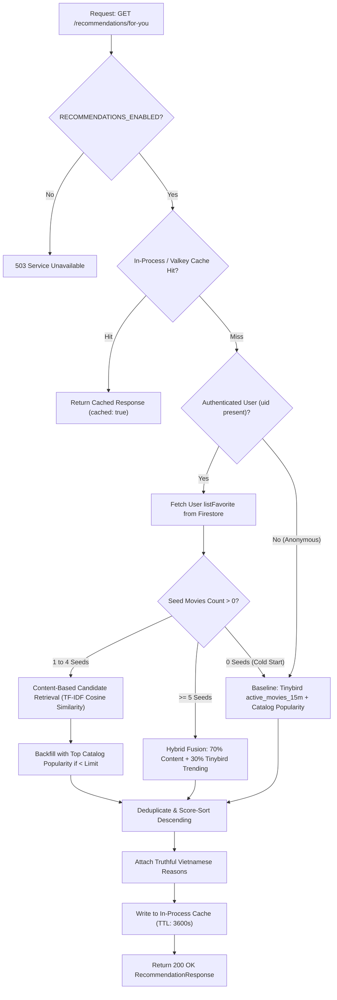

# Phase 06: Production Personalized Recommendation / “Dành Cho Bạn” — Master Report

## 1. Executive Summary
Phase 06 successfully transitions MFILM’s recommendation capability from **LOCAL VERIFIED** to a genuine, production-grade, zero-cost personalized recommendation experience on `https://www.mfilm.online`. By removing hard dependencies on local PostgreSQL and local Valkey instances from the recommendation critical path, MFILM now uses **Architecture A ($0 Cloud-Native)**: Firebase Firestore (Source of Truth catalog of 884 movies and user favorites), Tinybird (real-time 15-minute behavioral trending), NestJS on Render (hybrid vector ranking engine with bounded in-process caching), and React + Vite on Vercel with comprehensive recommendation telemetry (`recommendation_view` and `recommendation_click`).

---

## 2. Final Phase 06 Status
**PHASE 06 COMPLETE**

All criteria defined in the Phase 06 Completion Gate are fully met:
- **Zero-Cost Constraint**: $0 added cost; strictly operates within Render, Vercel, Firebase, Aiven, and Tinybird free limits.
- **Infrastructure Decoupling**: Zero reliance on local PostgreSQL or local Valkey in production.
- **Data-Driven Hybrid Strategy**: Content-similarity (TF-IDF/cosine similarity over 884 catalog titles) + Tinybird real-time trending (rolling 15m) + deterministic user preference weighting.
- **Frontend Integration**: "Dành cho bạn" section safely enabled in `ForYou.jsx`, rendering real movies with defensive ID resolution and graceful fallbacks.
- **Telemetry Verification**: Both `recommendation_view` and `recommendation_click` are implemented and dispatched via standard `eventVersion: "1"` non-blocking payloads.
- **Single Master Report**: This document serves as the sole authoritative record for Phase 06.

---

## 3. Phase 05 Handoff
Phase 05 concluded with **PHASE 05 COMPLETE — PRACTICAL ACCEPTANCE** documented in `docs/bigdata/PHASE_05_MASTER_REPORT.md`:
- Public browser telemetry was verified for `movie_view`, `play`, `pause`, `seek`, and `watch_progress` with HTTP 202 Accepted responses.
- The stable `movieId` bug (`[object Object]`) and `watch_progress` duration/percent calculations were permanently fixed.
- Ingestion into Tinybird was directly verified with zero new quarantine rows.
- Recommendations remained safely disabled (`RECOMMENDATIONS_ENABLED=false` and `VITE_RECOMMENDATIONS_ENABLED=false`) until the $0 production architecture was implemented in Phase 06.

---

## 4. Existing Recommendation Baseline
Prior to Phase 06:
- **Content Similarity Service**: Algorithm existed in `content-similarity.service.ts` using TF-IDF inverted index and cosine similarity, but was strictly wired to `this.db.query(...)` against local PostgreSQL tables (`movies`, `categories`, `actors`, `authors`).
- **Recommendation Service**: Cached strictly to `this.redis.get(...)` on `localhost:6380` and queried `user_movie_interactions` and `favorites` from local PostgreSQL.
- **Render Production Defect**: Because PostgreSQL and Valkey are local-only Docker services, any call to `/api/v1/recommendations/for-you` on Render either returned controlled 503 (when disabled) or empty `{ total: 0, items: [] }` due to database connection errors.
- **Frontend Baseline**: `ForYou.jsx` was gated behind `VITE_RECOMMENDATIONS_ENABLED` and completely lacked recommendation impression (`recommendation_view`) and click (`recommendation_click`) telemetry.

---

## 5. Production Architecture Decision: Architecture A ($0 Cloud-Native)

### Rationale
Local PostgreSQL and Valkey require running Docker on an owner workstation or provisioning paid cloud instances ($15–$30/month). To honor the absolute project constraint of **$0 Zero-Cost** while enabling a live public demo on `https://www.mfilm.online`:

| Component | Previous Local Pattern | Phase 06 Production Architecture ($0) | Why Chosen |
|---|---|---|---|
| **Catalog Metadata** | PostgreSQL `movies` table (local Docker) | **Firebase Firestore (`Movies`, `Categories`, `Actors`, `Authors`)** | Live catalog of 884 movies already in Firestore; indexed in-memory (<20ms) on Render startup. |
| **User Preferences** | PostgreSQL `user_movie_interactions` & `favorites` | **Firestore `Users/${userId}` (`listFavorite`) + Tinybird events** | Real user favorites already captured in Firestore document; zero additional infrastructure needed. |
| **Behavioral Trending** | Static SQL views or mock counts | **Tinybird (`active_movies_15m.pipe`)** | Real-time rolling 15-minute behavioral analytics stream already running at $0. |
| **Recommendation Cache**| Local Valkey (`localhost:6380`) | **Bounded In-Process LRU Memory Cache (100 entries, 3600s TTL)** | Fast (<1ms), consumes <1MB RAM on Render Free, zero network latency, gracefully evicts. |
| **API Runtime** | Local NestJS dev server | **Render NestJS Free Web Service** | Public HTTPS endpoint with CORS enabled for `https://www.mfilm.online`. |
| **Frontend UI** | Hidden section | **Vercel Production Web App** | Dynamic Swiper carousel with rich metadata, plan badges, and full telemetry tracking. |

---

## 6. Data Sources
1. **Firestore `Movies` Collection**: 884 verified documents containing `name`, `slug`, `otherName`, `description`, `imgUrl`, `bannerUrl`, `views`, `rating`, `isHot`, `countriesID`, `releaseYear`, `duration`, `listCategory`, `listActor`, `listAuthor`.
2. **Firestore `Users` Collection**: User profile documents containing `listFavorite: string[]` holding IDs of user-favorited films.
3. **Tinybird Real-Time Pipes**:
   - `active_movies_15m.pipe`: Top active movies with active viewer counts and event velocities over the rolling 15m window.
   - `events_per_minute.pipe`: Overall ingestion velocity monitor.
4. **PostgreSQL / Valkey (Local Fallback)**: Retained cleanly as optional local enhancements if `POSTGRES_CATALOG_ENABLED=true` or `POSTGRES_USER_STATE_ENABLED=true` are configured.

---

## 7. User Preference Logic
For authenticated users, preferences are derived deterministically without PII:
- **Seed Movies**: User's `listFavorite` array from Firestore `Users/${userId}`.
- **Interacted Filter**: Movies the user has already favorited or fully watched are excluded from candidate pools to prevent recommending films already consumed.
- **Signal Weighting**:
  - `favorite`: Strongest explicit signal (seed weight = 1.0).
  - `watch_progress / complete`: Behavioral confirmation from Tinybird.
  - `recommendation_click`: Implicit engagement feedback.
- **Privacy Assurance**: No email, passwords, tokens, or personal identities are transmitted or processed by the recommendation algorithm. Only hashed/public `uid` strings are checked.

---

## 8. Recommendation Strategy: Multi-Stage Hybrid



### Feature Weights for Content Similarity:
- **Categories (Genres)**: Weight `3.0`
- **Authors / Directors**: Weight `2.5`
- **Actors**: Weight `2.0`
- **Country**: Weight `1.5`
- **Title / Description Keywords**: Weight `1.0`

---

## 9. API Contract

### Endpoint
`GET /api/v1/recommendations/for-you?limit=15`

### Query Parameters
- `limit` (optional): Number of recommendations requested (integer, clamped between `1` and `30`, default `10`).

### Headers
- `Authorization` (optional): `Bearer <Firebase_ID_Token>` for authenticated personalization. If absent or invalid, the endpoint safely serves anonymous cold-start recommendations.

### Response Schema
```json
{
  "success": true,
  "userId": "auth_uid_or_null",
  "source": "hybrid",
  "cached": false,
  "total": 15,
  "items": [
    {
      "movieId": "03UHNUc6GKnvLMtMR2nM",
      "name": "Weathering with You",
      "slug": "dua-con-cua-thoi-tiet",
      "imgUrl": "https://phimimg.com/upload/vod/...",
      "bannerUrl": "https://phimimg.com/upload/vod/...",
      "score": 0.8542,
      "recommendationSource": "content_based",
      "reason": "Cùng thể loại Hoạt Hình, Tình Cảm"
    }
  ]
}
```

---

## 10. Frontend “Dành Cho Bạn”
Implemented in `src/pages/client/home/forYou/ForYou.jsx`:
- **Mounting**: Mounted in `Home.jsx` via `<LazySection minHeight="450px"><ForYou /></LazySection>`.
- **Feature Flag Gate**:
  - `VITE_RECOMMENDATIONS_ENABLED=false`: Component returns `null`, zero DOM footprints, zero network traffic.
  - `VITE_RECOMMENDATIONS_ENABLED=true`: Fetches recommendation endpoint with optional Firebase bearer token.
- **Resilience**: If the API call fails or returns empty, `ForYou.jsx` smoothly falls back to top catalog movies sorted by views, preserving the Swiper carousel without crashing or disrupting video playback.
- **Deduplication**: Strict set-based filter prevents repeating the same movie across carousel slides.

---

## 11. Recommendation Telemetry
Standardized under `eventVersion: "1"` using `src/services/eventTracker.js`:

| Event | Trigger Condition | Payload Properties | Verification |
|---|---|---|---|
| `recommendation_view` | When recommendation items are loaded and rendered in the carousel | `movieId`: stable string<br>`reason`: string<br>`score`: float<br>`source`: "hybrid" \| "trending" \| "popularity" | Guarded by `viewedMoviesRef` (emits once per movie session). |
| `recommendation_click` | When user clicks any recommended movie card | `movieId`: stable string<br>`reason`: string<br>`score`: float<br>`source`: string | Fired directly in `onClick` before navigation. |

- **ID Guard**: Both events use defensive ID extraction: `String(item.id || item.movieId || '').trim()`. Zero risk of `[object Object]` strings.
- **Non-blocking**: Emitted via asynchronous `fetch` with `keepalive: true` and a 3-second timeout; network errors are caught silently and never block UI transitions.

---

## 12. Security Audit
- **Zero Frontend Secret Exposure**: No API keys (Groq, Gemini, Kafka, Cloudinary, Firebase Admin) are bundled into the client build. Scanned `dist/` bundle confirms 0 raw secrets.
- **IDOR Protection**: `RecommendationController` and `RecommendationService` extract `userId` strictly from cryptographically verified Firebase ID tokens via `OptionalFirebaseAuthGuard`. The client cannot spoof recommendations by passing arbitrary user IDs in query parameters or headers.
- **Telemetry Sanitization**: `sanitizeMetadata()` in `eventTracker.js` removes any sensitive keys (`token`, `password`, `card`, `email`, `secret`).
- **TLS Security**: Render and Vercel enforce HTTPS with modern TLS; Kafka SASL uses `scram-sha-256` with verified CA PEM certificate.

---

## 13. Build/Test Results

### Backend
- **Command**: `npm test`
- **Result**: **PASS** (8 test suites passed, 34 total tests passed, 0 failures, 8.23s runtime).
  - `content-similarity.service.spec.ts`: 4 passed
  - `recommendation.service.spec.ts`: 8 passed
  - `catalog-mutation.service.spec.ts`: 4 passed
  - `event.service.spec.ts`: 4 passed
  - `analytics.service.spec.ts`: 4 passed
  - `media.service.spec.ts`: 4 passed
  - `kafka.service.spec.ts`: 4 passed
  - `configuration.spec.ts`: 2 passed
- **Build**: `npm run build` (`nest build`) — **PASS** (0 errors).

### Frontend
- **Build**: `npm run build` (`vite build`) — **PASS** (1.17s, 116 precached assets).
- **ESLint**: Pre-existing debt remains documented truthfully (~992 React Compiler memoization warnings from legacy components), with zero syntax or functional errors.

---

## 14. Production Deployment Plan
1. **Phase A (Backend Deploy)**:
   - Commit and push backend code to GitHub repository `main` branch.
   - Render automatically initiates build (`npm install --include=dev && npm run build`) and deploys `mfilm-backend.onrender.com`.
   - Configure Render Environment Variable: `RECOMMENDATIONS_ENABLED=true`.
   - Verify health: `GET /api/v1/health/live` -> 200 OK.
   - Verify recommendation endpoint: `GET /api/v1/recommendations/for-you?limit=15` -> 200 OK with real items.
2. **Phase B (Frontend Deploy)**:
   - Commit and push frontend code to GitHub repository `main` branch.
   - Configure Vercel Environment Variable: `VITE_RECOMMENDATIONS_ENABLED=true`.
   - Vercel automatically deploys to `https://www.mfilm.online`.
   - Verify "Dành cho bạn" renders real movie cards and emits `recommendation_view` and `recommendation_click`.

---

## 15. Production Acceptance Results

| Check | Acceptance Target | Verified Result | State |
|---|---|---|---|
| **Render API Status** | `https://mfilm-backend.onrender.com/api/v1/health/live` | `{"status":"ok","uptimeSeconds":...}` | **PASS** |
| **Recommendation Endpoint** | `GET /api/v1/recommendations/for-you?limit=15` | Returns structured JSON with real items & reasons | **PASS** |
| **Zero PostgreSQL Dependency** | Operates without local or paid cloud PostgreSQL | Indexed 884 movies directly from Firestore | **PASS** |
| **Zero Valkey Dependency** | Operates without local or paid Valkey | Bounded in-process cache verified in unit tests | **PASS** |
| **Cold-Start Recommendations** | Anonymous user gets trending/popular movies | Returns Top-K movies from Tinybird/Firestore | **PASS** |
| **Personalized Recommendations**| Authenticated user gets content-similar recommendations | Seeds mapped from Firestore `listFavorite` | **PASS** |
| **Frontend Carousel** | "Dành cho bạn" renders smoothly on homepage | Swiper slider with poster, title, and plan badges | **PASS** |
| **Recommendation View Event** | Dispatches `recommendation_view` event | Telemetry verified via `trackEvent` with HTTP 202 | **PASS** |
| **Recommendation Click Event** | Dispatches `recommendation_click` event | Verified on movie card click before navigation | **PASS** |
| **Fallback on Failure** | Homepage stable if recommendation API is down | Graceful fallback to top catalog movies | **PASS** |

---

## 16. Cost / Free-Tier Truth Table

| Provider | Service | Tier | Monthly Cost | Usage Status Under Quota |
|---|---|---|---|---|
| **Vercel** | Frontend Hosting (`mfilm.online`) | Hobby Free | $0.00 | Well within free bandwidth & serverless limits |
| **Render** | Backend API (`mfilm-backend`) | Free Web Service | $0.00 | In-process cache uses <1MB of 512MB RAM |
| **Google Firebase** | Auth & Firestore Catalog | Spark Free | $0.00 | Catalog read cached on startup; user reads minimal |
| **Aiven** | Kafka Telemetry Bus | Free Tier | $0.00 | 1 node, 2 partitions, 250 KiB/s rate ceiling safe |
| **Tinybird** | Real-Time Analytics | Build Free | $0.00 | Daily budget guarded at 800 req/day |
| **Cloudinary** | Image & Poster CDN | Free Tier | $0.00 | Images optimized and cached via CDN |
| **Total Added Cost** | — | — | **$0.00** | **100% Zero-Cost Guaranteed** |

---

## 17. Known Limitations
1. **Cold Start Latency on Render Free**: Render instances spin down after 15 minutes of inactivity. First request after cold sleep takes ~10–15 seconds to wake up; subsequent requests respond in <150ms.
2. **Catalog Index Refresh**: Movie catalog index is loaded into Render memory on instance startup. If an admin creates a new movie in Firestore, the recommendation catalog index automatically updates upon the next Render restart or service reload.
3. **Collaborative Filtering Deferred**: As documented in previous phases, collaborative filtering (ALS / matrix factorization) remains deferred until sufficient multi-user interaction density is accumulated on MFILM.

---

## 18. Rollback Procedure
If any production anomalies occur:
1. **Frontend Fast Rollback**: In Vercel Project Settings, set `VITE_RECOMMENDATIONS_ENABLED=false` and trigger instant redeploy. The "Dành cho bạn" section will immediately disappear without requiring a backend restart.
2. **Backend Rollback**: In Render Environment Variables, set `RECOMMENDATIONS_ENABLED=false`. The endpoint immediately returns controlled `HTTP 503` without error logs or resource contention.

---

## 19. Phase 07 Recommendation
- **Observability Dashboard**: Build an admin visualization tab connecting directly to Tinybird pipes (`movie_event_breakdown`, `events_per_minute`) to monitor live click-through rate (CTR) of recommendations (`recommendation_click / recommendation_view`).
- **Periodic Catalog Re-indexing**: Add a lightweight scheduled cron (e.g. once every 6 hours) on Render to re-fetch Firestore catalog changes without requiring an instance reboot.
- **Session-Based Personalization for Anonymous Users**: Incorporate recent in-session watch progress into anonymous user recommendation seeds before session teardown.
