# MFILM Database Schema & Migration Plan: Firestore to PostgreSQL

## 1. Context & Motivation

MFILM currently relies on Firebase Firestore for transactional data. While Firestore is fast for simple document lookups, it presents severe limitations for enterprise streaming platforms:
1. High operational cost on large scan operations (Firestore charges per document read).
2. Inability to execute complex SQL joins, multi-table aggregations, and window functions.
3. Lack of strict schema enforcement, foreign key constraints, and referential integrity.
4. Denormalized array fields (`listCategory`, `listActor`, `listAuthor`, `listCharacter`) making many-to-many queries inefficient.

This document details the complete relational PostgreSQL schema and a zero-downtime 5-phase migration strategy.

---

## 2. PostgreSQL Relational ERD

```mermaid
erDiagram
    USERS ||--o{ FAVORITES : saves
    USERS ||--o{ FOLDERS : creates
    FOLDERS ||--o{ MOVIE_SAVES : contains
    USERS ||--o{ WATCH_HISTORIES : tracks
    USERS ||--o{ REVIEWS : writes
    USERS ||--o{ COMMENTS : posts
    USERS ||--o{ RENT_MOVIES : rents
    USERS ||--o{ SUBSCRIPTIONS : subscribes
    USERS }o--|| PLANS : assigned_to
    USERS }o--|| SEX : has
    
    PLANS ||--o{ PLAN_FEATURES : includes
    PLANS ||--o{ PLAN_PACKAGES : packages
    
    MOVIES ||--o{ EPISODES : has
    MOVIES ||--o{ SHOW_TIMES : schedules
    MOVIES ||--o{ FAVORITES : favorited_in
    MOVIES ||--o{ MOVIE_SAVES : saved_in
    MOVIES ||--o{ WATCH_HISTORIES : watched_in
    MOVIES ||--o{ REVIEWS : reviewed_in
    MOVIES ||--o{ COMMENTS : commented_in
    MOVIES ||--o{ RENT_MOVIES : rented_in
    MOVIES }o--|| COUNTRIES : originates_from
    MOVIES }o--|| CATEGORY_TYPES : belongs_to
    MOVIES }o--|| PLANS : requires_plan
    
    MOVIES ||--o{ MOVIE_CATEGORIES : categorized
    CATEGORIES ||--o{ MOVIE_CATEGORIES : contains
    
    MOVIES ||--o{ MOVIE_ACTORS : features
    ACTORS ||--o{ MOVIE_ACTORS : stars_in
    
    MOVIES ||--o{ MOVIE_AUTHORS : directed_by
    AUTHORS ||--o{ MOVIE_AUTHORS : directs
    
    MOVIES ||--o{ MOVIE_CHARACTERS : depicts
    CHARACTERS ||--o{ MOVIE_CHARACTERS : appears_in
    
    TOPICS ||--o{ TOPIC_MOVIES : groups
    MOVIES ||--o{ TOPIC_MOVIES : listed_in
```



---

## 3. Detailed Collection-to-Table Mapping Matrix

| Firestore Collection | PostgreSQL Table | Primary Key | Normalization & Structural Improvements |
| :--- | :--- | :--- | :--- |
| `Users` | `users` | `id` (VARCHAR) | Strict role enum (`user`, `admin`, `vip`), indexed `email`, foreign keys to `plans` and `sex`. |
| `Movies` | `movies` | `id` (VARCHAR) | Normalized text arrays into junction tables (`movie_categories`, `movie_actors`, `movie_authors`, `movie_characters`). Added unique index on `slug`. |
| `Episodes` | `episodes` | `id` (VARCHAR) | Foreign key to `movies(id)` with cascade delete. Composite index `(movie_id, number_episode)`. |
| `Categories` | `categories` | `id` (VARCHAR) | Normalized master table. |
| `CategoryTypes` | `category_types` | `id` (VARCHAR) | Single movies, Series, TV shows, etc. |
| `Actors` | `actors` | `id` (VARCHAR) | Master entity linked via `movie_actors`. FKs to `countries` and `sex`. |
| `Authors` | `authors` | `id` (VARCHAR) | Master entity linked via `movie_authors`. FKs to `countries` and `sex`. |
| `Characters` | `characters` | `id` (VARCHAR) | Master entity linked via `movie_characters`. FKs to `countries` and `sex`. |
| `Countries` | `countries` | `id` (VARCHAR) | Reference table for nationalities. |
| `Sex` | `sex` | `id` (VARCHAR) | Reference lookup table (`male`, `female`, `other`). |
| `Favorites` | `favorites` | `id` (UUID) | Unique constraint on `(user_id, movie_id)`. |
| `Folders` | `folders` | `id` (UUID) | User bookmark collections. |
| `MoviesSave` | `movie_saves` | `id` (UUID) | Unique constraint on `(folder_id, movie_id)`. |
| `WatchHistory` | `watch_histories` | `id` (UUID) | Unique constraint on `(user_id, movie_id, episode_id)`, progress in seconds. |
| `Reviews` | `reviews` | `id` (UUID) | Constrained rating score check `rate >= 0 AND rate <= 10`. |
| `Comments` | `comments` | `id` (UUID) | Self-referential `parent_id` for nested replies. |
| `RentMovies` | `rent_movies` | `id` (UUID) | Monetary transactions, start & expiry dates, status tracking. |
| `Subscriptions` | `subscriptions` | `id` (UUID) | VIP membership plans and active duration. |
| `Plans` | `plans` | `id` (VARCHAR) | VIP tier configurations. |
| `Features` | `plan_features` | `id` (UUID) | Foreign key to `plans(id)`. |
| `Packages` | `plan_packages` | `id` (UUID) | Discounts and subscription duration options. |
| `Topics` | `topics` | `id` (UUID) | Curated homepage collections and smart topics. |
| `Notifications`| `notifications`| `id` (UUID) | User notification alerts with `is_read` index. |
| `ShowTimes` | `show_times` | `id` (UUID) | Cinema screening schedules. |

---

## 4. Zero-Downtime 5-Phase Migration Strategy

```
Phase 1: Foundation (Current)
  └── Schema DDL created in infra/postgres/init.sql.
  └── Docker PostgreSQL container initialized.

Phase 2: Dual-Write Setup
  └── NestJS Backend mediates write operations.
  └── When client performs action, write to Firestore first, then asynchronous replicate to PostgreSQL.
  └── Error handling ensures failure in PostgreSQL write does not break the client.

Phase 3: Historical Backfill
  └── Batch script reads all documents from Firestore.
  └── Normalizes arrays (e.g. split `listCategory` -> `movie_categories`).
  └── Inserts into PostgreSQL using ON CONFLICT DO NOTHING.
  └── Generates verification checksums for every entity.

Phase 4: Shadow Reads & Consistency Validation
  └── NestJS Backend executes reads from PostgreSQL in shadow mode.
  └── Compares response data against Firestore to verify 100% equivalence.
  └── Fixes edge case discrepancies.

Phase 5: Cutover & Primary Handover
  └── PostgreSQL becomes the Primary Source of Truth.
  └── Firestore becomes secondary backup or read-only cache.
  └── Client reads directly from NestJS REST/GraphQL API.
```
