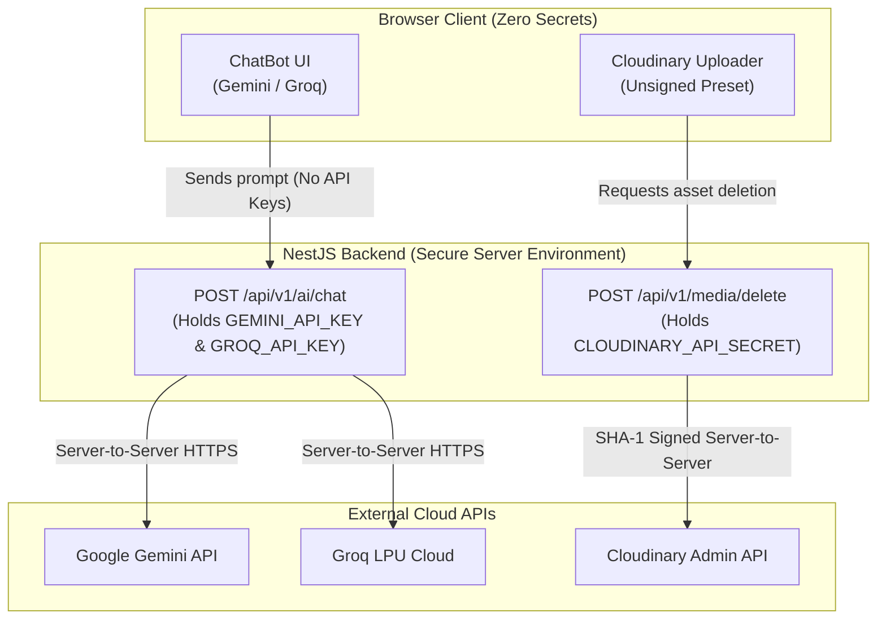

# MFILM Security Audit & Remediation Blueprint

## 1. Executive Summary

A comprehensive security analysis was performed across the entire MFILM repository prior to cloud deployment. The objective is to identify, classify, and eliminate any exposed credentials, client-bundled server secrets, and insecure patterns.

> [!CAUTION]
> **Key Finding:**
> Hardcoded Cloudinary API credentials were discovered directly inside a tracked frontend file (`src/config/cloudinaryConfig.jsx`). Furthermore, AI provider keys (Gemini and Groq) are loaded via `VITE_*` environment variables, causing them to be baked into client browser bundles.

---

## 2. Findings Classification Matrix

| Finding ID | Component / File | Exposure Type | Severity | Classification | Status | Required Remediation |
| :--- | :--- | :--- | :---: | :---: | :---: | :--- |
| **SEC-01** | `src/config/cloudinaryConfig.jsx:30` | Hardcoded `apiSecret` | **CRITICAL** | **SERVER-ONLY SECRET** | **ROTATE REQUIRED** | 1. Immediately rotate API secret in Cloudinary Dashboard. 2. Remove secret from frontend code. 3. Move deletion logic to NestJS backend. |
| **SEC-02** | `src/config/cloudinaryConfig.jsx:29` | Hardcoded `apiKey` | **HIGH** | **SERVER-ONLY SECRET** | **ROTATE REQUIRED** | Rotate key alongside `apiSecret` and manage via backend env. |
| **SEC-03** | `src/utils/Constants.jsx:404` & `.env` | `VITE_GEMINI_API_KEYS` | **HIGH** | **SERVER-ONLY SECRET** | **MIGRATE TO BACKEND** | Move AI model calls behind a NestJS `/api/v1/ai/chat` proxy. Remove `VITE_` prefix. |
| **SEC-04** | `src/components/.../GroqChatBot.jsx` & `.env` | `VITE_GROQ_API_KEYS` | **HIGH** | **SERVER-ONLY SECRET** | **MIGRATE TO BACKEND** | Move Groq LPU calls behind NestJS backend proxy. |
| **SEC-05** | `src/utils/Constants.jsx:360` | PayPal Client ID | **LOW** | **PUBLIC CONFIG** | **OK** | Public client ID is required for client SDK initialization. |
| **SEC-06** | `src/config/firebaseConfig.js:8-14` | Firebase Web API Config | **LOW** | **PUBLIC CONFIG** | **OK** | Public identifier for Firebase Web SDK. Secure via Firestore Security Rules. |
| **SEC-07** | `api/cron-sync.js:6-15` | Firebase Admin Private Key | **HIGH** | **SERVER-ONLY SECRET** | **OK** | Correctly read from server environment variable `FIREBASE_PRIVATE_KEY`; not in Git. |
| **SEC-08** | Root `.env` & `.env.local` | Local Environment Files | **MEDIUM** | **SERVER-ONLY SECRET** | **OK** | Verified excluded by `.gitignore` and not tracked in Git. |
| **SEC-09** | `backend/.env` | Backend Environment File | **LOW** | **SERVER-ONLY SECRET** | **OK** | Excluded from production git; local development fallback only. |

---

## 3. Remediation Blueprint: Backend Proxy Architecture

To eliminate client-side secret exposure without breaking the user experience, two backend proxy modules are planned:

### Action Plan for the Repository Owner:
1. **Rotate Cloudinary Secret**: Log into Cloudinary Console -> Settings -> Access Keys -> Generate New Key/Secret.
2. **Move AI Keys to Backend**: Store `GEMINI_API_KEY` and `GROQ_API_KEY` in the Render Web Service environment variables, completely removing them from Vercel frontend build variables.
